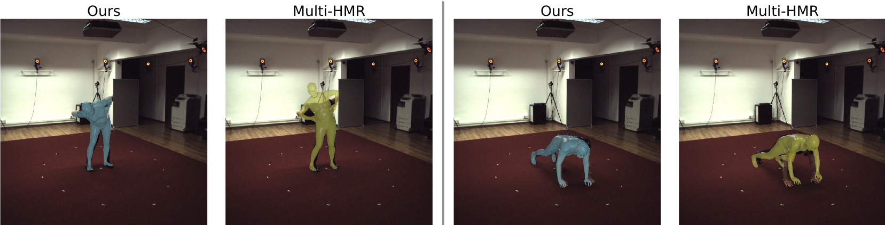

# Efficient 2D to Full 3D Human Pose Uplifting including Joint Rotations

This is the official implementation of the paper "Efficient 2D to Full 3D Human Pose Uplifting including Joint Rotations".

The paper is accepted for [CVsports'25](https://vap.aau.dk/cvsports/) at [CVPR 2025](https://cvpr.thecvf.com/Conferences/2025). 



## Installation

Create a new virtual environment and install the required packages from the `requirements.txt` file. We tested all the code using python 3.12.9.

### Paths

Adjust the paths in the file `paths.py` according to your locations. The following paths need to be adjusted:
- `SMPLX_DIR`: Path to the `smpl-models` directory containing SMPL-X model files. You can download them from the official SMPL-X website.
- `VPOSER_DIR`: Path to the directory containing the VPoser trained weights. Should be a directory called `V02_05`
- `FIT3D_DIR`: Path to the fit3D dataset base directory
- `LOG_DIR` Path to the directory where the log files should be stored

## Data Preparation

We organize the fit3D dataset in a specific data format to access it quickly. You can execute the preparation for this data format by executing the following command. Make sure to set the paths correctly beforehand. You can adjust the storage of the prepared data by changing the `FIT3D_PROCESSED_ROOT` variable in the `paths.py` file.

```bash
python -m dataset.fit3d.preparation.preparation
```

We train our models based on the 2D keypoint output from vitpose. You can download the result for fit3D [here](https://mediastore.rz.uni-augsburg.de/get/0G8X0KU02s/). Place the file in the same folder as the processed data is stored.

## Evaluation

You can evaluate our trained models by running 
```bash
python -m run.eval -c <config-file> -w <weights-file>
```
You can further specify to output the joint-wise results by adding the flag `--per_joint`and to output the results for the 37 keypoints from the A2B paper by adding the flag `--kpts_37`. You can download the pretrained weights [here](https://mediastore.rz.uni-augsburg.de/get/bOKbRlbj4_/). The following table lists the results, the required config file and the weights. All config files can be found in the experiments folder.

| Model   | Config            | Weights                | MPJPE [mm] | MPJAE [deg] |
|---------|-------------------|------------------------|-----------:|------------:|
| N-RM-2  | fit3d_n_rm_2.json | N-RM-2/weights_09.pth  |      39.40 |        8.82 |
| S-AA-3  | fit3d_s_aa_3.json | S-AA-3/weights_40.pth  |      36.69 |        9.21 |
| V-2     | fit3d_v_2.json    | V-2/weights_15.pth     |      38.76 |       15.90 |
| PS-AA-3 | fit3d_s_aa_3.json | PS-AA-3/weights_40.pth |      37.30 |       16.18 |


## Training

You can train all the models yourself by running 
```bash
python -m run.train -c <config-file>
``` 
with one of the provided configs from the experiments folder. The weights and tensorboard output will be logged to a subfolder of the `LOG_DIR` that you set in the `paths.py` file. The validation is executed on a subset of all frames from s09 (every 4th frame), otherwise the validation would take a very long time. You can use the evaluation script explained in the previous section for evaluating your trained model. You might have to adjust the path to the pretrained weights. We use `amass_351.pth` from the weights folder.

## Visualization

We provide a visualization tool that can be applied to arbitrary videos. However, so far the person detector and the trained ViTPose model could not be exported to onnx in a working way. The models provided so far are very bad, we will fix this in the future. For results using the real working ViTpose results, use the downloaded ViTPose results file as described below. However, if you want to download the broken 2D models and experiment with them, download them [here](https://mediastore.rz.uni-augsburg.de/get/3ZlfF6d3YQ/) and put them in the folder `vitpose/models_vitpose`.

To run the visualization, execute 
```bash
python -m visualization.main -c <config> -w <weights> -v <video> -o <output_dir> --fit3d <path to downloaded vitpose 2d keypoints>
``` 
A visualization with the given video and model is then created and stored in the given output folder. The visualization takes several optional settings, which will be explained in the following:
- -c: Path to config file
- -w: Path to weights file
- -v: Path to video
- -o: Folder for visualization output
- -b: If you want to specify beta parameters for the visulized person, provide them here (10 betas as a list)
- --matplotlib: If set, the visualization is done with matplotlib instead of pyrender, which takes a lot more time but also works without OpenGL and pyrender installed.
- --smoothing: If set, a smoothing is performed across the single frame results. Leads to less jitter in the output, which looks a little better.
- -a: Path to a json file containing a dictionary mapping from anthropometric measurement names to values. An example is provided in `visualization/example_anthros.json`
- --cam:  In case pyrender is used: `[fx, fy, cx, cy]` of the camera. If not set, a default camera is used. In case of matplotlib: azimuth angle for the camera, if not set, a standard of 30 is used. 
- --pelvis_pos:  only usable with pyrender: to reproject the meshes at the correct positions to the image, the pelvis positions are needed. If not set, the rendering is done without the image. Provide the values as a npy file.
- --fit3d: Currently, the onnx export does not work correctly. To load the vitpose results from a file, set this path. It should be the npz file that you can download as described above (download [here](https://mediastore.rz.uni-augsburg.de/get/0G8X0KU02s/)).

Example for visualization with reprojection in the image (camera set, body shape set, pelvis pos set): 


https://github.com/user-attachments/assets/0fbe3efb-a046-4bbf-a94c-aa4eeb289492


Example for visualization without reprojection in the image with pyrender: 


https://github.com/user-attachments/assets/00f5a5bf-618c-40e0-81e5-703cc8fbeb3e


Example for visualization without reprojection in the image with matplotlib: 


https://github.com/user-attachments/assets/31b1fc9d-d4ee-4451-a30e-f26c5d0b5961


## Citation

In case this work is useful for your research, please consider citing:
```bibtex
@article{ludwig2025efficient2d3dhuman,
      title={Efficient 2D to Full 3D Human Pose Uplifting including Joint Rotations}, 
      author={Katja Ludwig and Yuliia Oksymets and Robin Schön and Daniel Kienzle and Rainer Lienhart},
      year={2025},
      journal = {IEEE/CVF International Conference on Computer Vision and Pattern Recognition Workshops (CVPRW)},
}
```
